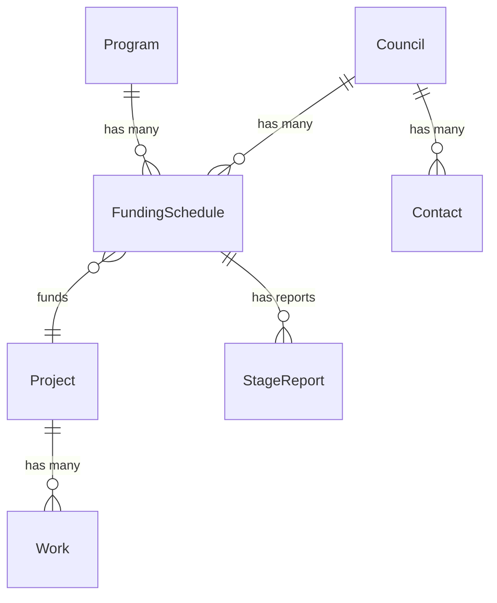

# Django Models Design Plan for Housing Projects Management System

## Overview
This plan outlines the modifications required to align the existing Django models in `models.py` with the specified requirements. Existing models will be updated, new models added, and relationships refined. The design emphasizes:
- Proper foreign key relationships
- Calculated fields via properties or methods
- Derivations for automation
- Sensible defaults, __str__ methods

## Key Changes and Additions

### 1. Contact Model (New)
- **Fields**: name, position, email, phone
- **Relationship**: ForeignKey to Council (many contacts per council)
- **__str__**: f"{self.name} ({self.position})"

### 2. Council Model (Modify Existing)
- **Added**: related_name to contacts
- **Retained**: name, abn
- **Relationship**: Through Contact

### 3. Program Model (Modify Existing)
- **Added**: funding_source (CharField with choices: Commonwealth, State)
- **Retained**: name, description, budget
- **__str__**: unchanged

### 4. FundingSchedule Model (Major Modify)
- **Removed**: FK to Project
- **Added**:
  - FK to Council
  - FK to Program
  - funding_schedule_number (IntegerField, unique per Council; use unique_together)
  -funding_amount
  - contingency_amount
  - total_funding (calculated property: funding_amount + contingency_amount)
  - Three auto-calculated instalments (properties or methods): each with amount, release_date, reference_number; 30%, 60%, 10% of funding_amount, rounded to nearest dollar
- **__str__**: f"{self.council} - {self.funding_schedule_number}"

- Note: Absorb payment fields instead of separate Instalment model.

### 5. Project Model (Modify Existing)
- **Added FKs**:
  - FK to FundingSchedule (allowing multiple projects per funding schedule?)
  - FK to Council and Program if not already
- **Added Fields**:
  - funding_schedule_amount
  - contingency_amount
  - total_funding (calculated property)
  - principal_officer (CharField)
  - senior_officer (CharField)
  - stage1_target, stage1_sunset, stage2_target, stage2_sunset (DateFields, some nullable)
  - state (CharField with choices: prospective, programmed, funded, commenced, under construction, completed; default: prospective)
  - Derived properties: is_late, is_overdue, is_on_time (based on dates and report existence)
- **Automation**: Use signals for state changes based on reports/approvals
- **__str__**: f"{self.name} ({self.council})" – similar to existing

### 6. Work Model (Modify Existing, serves as Address/Work)
- **Added**:
  - output_quantity (IntegerField; e.g. 4 units, 1 duplex)
  - address_line (CharField for full address; combine with existing street/suburb fields?)
- **Derived Fields** (properties):
  - total_dwellings: Sum output_quantity * multiplier for duplexes (1 for house/unit, 2 for duplex, 3 for triplex)
  - total_bedrooms: Sum bedrooms * total_dwellings
- **Retained**: work_type, output_type choices, other fields
- **__str__**: f"{self.address_line or self.street} - {self.get_work_type_display()}"

- (Note: Existing Address model can be merged into Work if desired, with address fields.)

### 7. StageReport Model (New)
- **Fields**:
  - FK to FundingSchedule
  - stage (IntegerField, choices: 1, 2)
  - submission_date
  - acceptance_date (nullable)
  - report_file (FileField)
  - checklist (JSONField for required items)
- **__str__**: f"Stage {self.stage} Report for {self.funding_schedule}"

### 8. Report Model (Future Skeleton)
- **Fields**: FK to Council/FundingSchedule, report_type (choices), file upload, snapshot of addresses/works (TextField or JSON)
- Not implemented yet; add as needed.

### Other Models
- Remove or repurpose existing Instalment (merged into FundingSchedule payments).
- Adjust Stage1Report/Stage2Report to align with new StageReport or remove if replaced.
- MonthlyTracker/QuarterlyReport can stay as Report skeletons.

## Relationships Visualization

## Implementation Steps
1. Modify existing models with added fields/relationships.
2. Add new Contact and StageReport models.
3. Implement calculated properties (e.g., total_funding) using @property decorators.
4. Add signals for automations (e.g., change Project state on StageReport acceptance).
5. Update admin.py registrations for new models.
6. Create and run migrations.
7. Test in Django shell for FKs and calculations.

## Assumptions and Notes
- Unique funding_schedule_number: Use unique_together(Meta) with council.
- Auto-calculated payments: Implement as model methods or properties; assume release_date as calculated dates (e.g., based on submission).
- Derivations for Project: Use properties with date comparisons (import datetime).
- Sensible defaults: state='prospective'; release_date as today + offsets.
- Files/JSON: Use FileField and JSONField; install django-jsonfield if needed.
- No changes to apps.py or settings unless Django version requires adjustments.